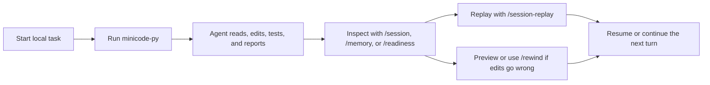
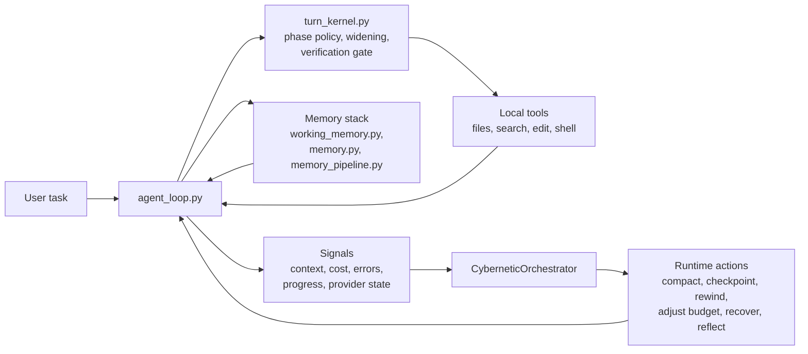

# Minicode - AI Coding Agent 学习版

<p align="center">
  <strong>基于 MiniCode Python 的深度剖析与学习实践 — 添加了完整中文注释、架构分析和学习框架。并且进行在记忆模块方面的优化</strong>
</p>

<p align="center">
  <a href="./README.zh-CN.md">中文</a>
  |
  <a href="https://github.com/QUSETIONS/MiniCode-Python">原项目仓库</a>
</p>

<p align="center">
  
</p>

> **📖 本项目是 [MiniCode-Python](https://github.com/QUSETIONS/MiniCode-Python) 的学习型 fork。**
> 原项目是一个轻量级的 AI coding agent 运行时。本 fork 在此基础上添加了：
> - 完整的全中文代码注释与星级评级
> - 核心模块的详细执行流程图
> - 结构化学习框架与面试指南
> - 精简版 agent 循环
> -记忆模块的优化与调试
<p align="center">
  
  
  
</p>

## At a Glance

MiniCode Python is for you if you want:

- a terminal coding agent that behaves like a runtime, not a chat window;
- durable sessions you can inspect, replay, resume, and summarize;
- a memory stack that can protect working context and re-inject relevant project knowledge;
- safe local editing with checkpoints, rewind preview, and recovery flows;
- explicit signals for verification, widening, provider readiness, and failures.

If you only remember one thing, remember this:

> MiniCode Python is optimized for local trust: you should be able to inspect the work, recover the edits, and understand why the agent stopped.

## Why This Repo Exists

Most coding-agent READMEs lead with model access and feature lists. MiniCode Python is organized around a different promise:

> the runtime should be observable, recoverable, and testable, not just clever.

That changes the product priorities:

| Priority | What it means here |
| --- | --- |
| Session-first | Sessions can be inspected, replayed, resumed, and summarized. |
| Recovery-first | File edits are checkpointed, previewable, and rewindable. |
| Runtime-first | Widening, verification, compaction, and stop reasons are explicit. |
| Local-first | The agent is built around real repos, local tools, and terminal workflows. |

## Why MiniCode Python

| Area | What MiniCode Python emphasizes |
| --- | --- |
| Durable sessions | Inspect, replay, resume, and summarize live or saved sessions with local commands. |
| Memory as a first-class system | Protect active task context, re-inject project knowledge, compact with memory awareness, and persist useful reflections over time. |
| Safe recovery | Automatic checkpoints, rewind preview, rewind safety groups, and saved-session rewind flows. |
| Runtime control | `single` and `single-deep` profiles, phase-aware execution, widening, verification gates, and structured stop reasons. |
| Observable behavior | Runtime timelines, readiness reports, provider diagnostics, transcript summaries, and benchmark artifacts. |
| Local product surface | CLI and TUI commands such as `/session`, `/session-replay`, `/memory`, `/checkpoints`, `/rewind`, and `/readiness`. |
| Verifiable implementation | The root package is backed by an active test suite, not aspirational docs. |

## What You Can Do Today

With the current repository state, you can already:

- run an interactive terminal agent with `minicode-py`;
- run a single-shot command with `minicode-headless`;
- inspect the current session with `/session`;
- browse previous sessions with `/sessions`;
- replay a session with `/session-replay`;
- inspect memory state with `/memory`;
- inspect checkpoints with `/checkpoints`;
- preview or execute rewinds with `/rewind-preview` and `/rewind`;
- inspect provider and fallback health with `/readiness`.

## 3-Minute Demo

### 0. What you need

- Python 3.11+
- a local terminal on Windows, macOS, or Linux
- model/provider credentials if you want live model execution

### 1. Install and launch

```bash
git clone https://github.com/QUSETIONS/MiniCode-Python.git
cd MiniCode-Python
python -m pip install -e .[dev]
minicode-py
```

### 2. Ask it to do a real repo task

```text
Explain this repository and tell me which commands matter most for day-to-day use.
```

You should expect the normal MiniCode loop here: inspect repo state, explain findings, then let you inspect, replay, or continue the session.

### 3. Inspect what the runtime is doing

```text
/session
/memory
/readiness
```

### 4. Replay or recover if needed

```text
/session-replay
/checkpoints
/rewind-preview
```

### 5. Run one-shot headless mode

```bash
minicode-headless "Explain what this repo does."
```

## Typical Workflow



The main point is simple: MiniCode Python is not trying to hide the runtime. It lets you see the work, inspect the state, and recover from mistakes without manually cleaning everything up.

That same philosophy applies to memory: active task context is protected, durable project knowledge can be re-injected when it matters, and compaction is allowed to reuse memory instead of blindly dropping context.

## Everyday Commands

If you only use six commands at first, use these: `/session`, `/sessions`, `/session-replay`, `/memory`, `/rewind-preview`, and `/readiness`.

| Command | What it does |
| --- | --- |
| `/session` | Show the current live session snapshot. |
| `/sessions` | List saved sessions for the current workspace. |
| `/session-replay` | Replay the current or a saved session with transcript and runtime context. |
| `/memory` | Show memory system status for the current workspace. |
| `/checkpoints` | Show checkpoint history for the current or a saved session. |
| `/rewind-preview` | Preview what a rewind would restore before changing files. |
| `/rewind` | Rewind the latest edit group, a step count, or a checkpoint id. |
| `/readiness` | Inspect runtime/provider readiness, fallback coverage, and product surface status. |

## Current Status

This repository is past the prototype stage. It already behaves like a usable local product, but it is still being tightened into a more polished lightweight Claude Code style experience.

The active package is the root `minicode/` package configured by `pyproject.toml` as `minicode-py`.

Current local verification result:

```text
1030 passed, 2 skipped, 3 warnings
```

Verification command:

```bash
python -m compileall -q minicode tests
pytest -q
```

Current state, honestly:

- core runtime, session, replay, checkpoint, rewind, and readiness surfaces are in good shape;
- memory is not bolted on: working memory, project memory, memory injection, and memory-aware compaction are already in the runtime path;
- provider and fallback diagnostics are much clearer than before;
- real provider availability still depends on your local credentials and configured channels;
- the project is usable today, but it is still evolving toward a more polished lightweight Claude Code experience.

The 3 warnings are unregistered `pytest.mark.benchmark` markers in benchmark tests. They are not failing behavior.

## Architecture



What matters is not the diagram itself. What matters is that runtime state is treated as something explicit:

- the loop can widen instead of silently stalling;
- verification can block a premature "done";
- memory can preserve task-critical context and re-inject project knowledge instead of relying only on the current chat window;
- session state can survive process boundaries;
- rewind can reverse local edits instead of asking you to clean them up by hand;
- readiness can tell you whether failure is local logic or provider availability.

## Repository Guide

| Path | Role |
| --- | --- |
| `minicode/` | Canonical Python package used by install and tests. |
| `tests/` | Active test suite. |
| `benchmarks/` | Runtime profile and release-readiness runners plus generated reports. |
| `docs/` | Architecture notes, optimization history, and productization reports. |
| `openspec/` | Specs, archived change records, and build/verify planning artifacts. |
| `.mini-code-memory/` | Workspace-level durable memory state created by the runtime. |

## Core Modules

| Module | Purpose |
| --- | --- |
| `minicode/agent_loop.py` | Main model and tool loop, runtime event flow, and product integration. |
| `minicode/turn_kernel.py` | Step policy, phase transitions, widening, and verification gates. |
| `minicode/session.py` | Durable sessions, inspect and replay views, checkpoints, and rewind helpers. |
| `minicode/cli_commands.py` | Local product commands such as session, replay, rewind, and readiness. |
| `minicode/memory.py` | Long-term project memory manager and retrieval surface. |
| `minicode/working_memory.py` | Protected working-memory entries that survive compaction pressure. |
| `minicode/memory_pipeline.py` | Closed-loop memory retrieval, injection, reflection writeback, and optimization path. |
| `minicode/product_surfaces.py` | User-facing summaries for readiness, hooks, instructions, delegation, and extensions. |
| `minicode/release_readiness.py` | Release-oriented runtime smoke and provider-readiness checks. |
| `minicode/model_switcher.py` | Bounded fallback and failover selection. |
| `minicode/runtime_profiles.py` | Runtime profiles such as `single` and `single-deep`. |
| `minicode/cybernetic_orchestrator.py` | Runtime control lifecycle facade. |

## MiniCode Family

| Version | Repository | Focus |
| --- | --- | --- |
| TypeScript | [LiuMengxuan04/MiniCode](https://github.com/LiuMengxuan04/MiniCode) | Mainline terminal agent, TUI, MCP, skills, sessions, and context controls. |
| Python | [QUSETIONS/MiniCode-Python](https://github.com/QUSETIONS/MiniCode-Python) | Local-first Python runtime with stronger session, rewind, readiness, and observability surfaces. |
| Rust | [harkerhand/MiniCode-rs](https://github.com/harkerhand/MiniCode-rs/tree/master) | Systems-side implementation and experiments. |
| Java | [hobbescalvin414-tech/minicode4j](https://github.com/hobbescalvin414-tech/minicode4j/tree/feat/default-ts-ui) | Java implementation with a TypeScript-style UI direction. |

## Documentation

Start here if you want the deeper implementation and productization record:


- [Chinese README](./README.zh-CN.md)
- [Optimization Summary](./docs/OPTIMIZATION_SUMMARY.md)
- [Memory Theory](./docs/memory_theory.md)
- [Minicode-lite Productization Design](./docs/superpowers/specs/2026-06-05-minicode-lite-productization-design.md)
- [Minicode-lite Build Plan](./docs/superpowers/plans/2026-06-05-minicode-lite-productization-build.md)
- [Minicode-lite Verify Report](./docs/superpowers/reports/2026-06-05-minicode-lite-productization-verify.md)
- [Main MiniCode Repository](https://github.com/LiuMengxuan04/MiniCode)

## Design Principles

- Keep the runtime inspectable.
- Treat memory as a controllable runtime subsystem, not an afterthought.
- Prefer measured signals over prompt folklore.
- Make recovery a product feature, not a manual cleanup step.
- Treat verification as part of execution, not just reporting.
- Keep docs aligned with implemented behavior, not future ambition.
