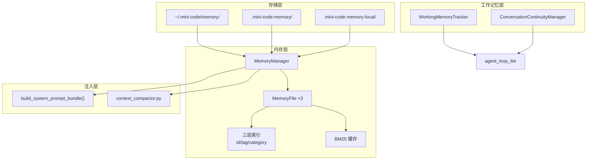

# SmartCode 记忆系统完整分析

> 基于对 `memory.py`（2549 行）、`working_memory.py`（412 行）、
> 4 个测试文件以及所有调用点的全面阅读。
> 目标是理解现有系统全貌，为叠加 Code Review 模式提供改造依据。

---

## 一、宏观架构：三层记忆



| 作用域 | 路径 | 生命周期 | 是否进 VCS | 用途 |
|:------:|------|:--------:|:----------:|------|
| `USER` | `~/.mini-code/memory/` | 永久 | 否 | 跨项目用户偏好、全局规则 |
| `PROJECT` | `.mini-code-memory/` | 随项目 | **可提交** | 团队共享规范、项目约定 |
| `LOCAL` | `.mini-code-memory-local/` | 随项目 | **不提交** | 个人临时笔记、本地设置 |

---

## 二、核心数据结构

### 2.1 MemoryEntry（`memory.py:738`）

单条记忆条目，是整个系统的最小数据单元：

```python
@dataclass
class MemoryEntry:
    id: str                       # 唯一标识 "project-1716979200-3"
    scope: MemoryScope            # user / project / local
    category: str                 # architecture/convention/decision/pattern/...
    content: str                  # 记忆内容文本
    created_at: float
    updated_at: float
    tags: list[str]               # 标签，用于快速检索
    usage_count: int              # 被引用次数，影响搜索排序权重
    domains: list[str]            # 领域分类（frontend/backend/database/...）
    tier: MemoryTier              # working/short_term/long_term/archival
    last_accessed: float          # 最后访问时间，时效性衰减
    related_to: list[str]         # 关联条目的 id 列表
    _cached_tokens: list[str]     # 分词缓存（不序列化）
```

**序列化格式（`memory.json`）：**
```json
{
  "scope": "project",
  "last_updated": 1716979200.0,
  "entries": [
    {
      "id": "project-1716979200-3",
      "scope": "project",
      "category": "architecture",
      "content": "本项目使用六边形架构...",
      "tags": ["architecture"],
      "usage_count": 5,
      "tier": "long_term",
      "domains": ["backend"],
      "related_to": ["project-1716978000-1"],
      ...
    }
  ]
}
```

> **MEMORY.md 也同时维护**，两种格式，同一数据源。JSON 给程序读，Markdown 给人看。

### 2.2 MemoryFile（`memory.py:866`）

每个作用域的"内存中容器"，带三层索引 + BM25 缓存：

```python
@dataclass
class MemoryFile:
    scope: MemoryScope
    entries: list[MemoryEntry]
    max_entries: int = 200         # 硬上限
    max_size_bytes: int = 25 * 1024  # 25KB 硬上限
    _id_index: dict[str, MemoryEntry]         # id → Entry
    _tag_index: dict[str, set[MemoryEntry]]   # tag → Entries
    _category_index: dict[str, list[MemoryEntry]]  # category → Entries
    _tokens_cache: dict[str, list[str]]       # id → tokens
    _idf_cache: dict[str, float] | None       # term → IDF
    _avgdl_cache: float | None                # 平均文档长度
```

### 2.3 MemoryTier（`memory.py:722`）

受 Atkinson-Shiffrin 记忆模型启发，四级存储架构：

```
WORKING → SHORT_TERM → LONG_TERM → ARCHIVAL
（当前会话） （<7天）    （<30天）    （永久，摘要存储）
```

自动升降级机制（`promote_memories()`）：
- 高频使用的 SHORT_TERM（usage_count >= 5, age > 7 天）→ 升级为 LONG_TERM
- 长期未访问的 LONG_TERM（last_accessed > 30 天）→ 降级为 ARCHIVAL
- 归档后被重新访问（< 7 天）→ 重新激活为 SHORT_TERM

---

## 三、写路径：记忆如何存入

### 3.1 用户主动写入

```
用户输入 "# this is a convention"
  │
  ▼
main.py L732 / tui/input_handler.py L367
  │
  ▼
MemoryManager.handle_user_memory_input()
  │  解析格式 → 确定 scope/category/content
  │  # → category="directive"
  │  /memory add user: xxx → scope="user"
  ▼
MemoryManager.add_entry(scope, category, content, tags)
  │  1. 自动分类（若 category="auto"）
  │  2. 生成 ID
  │  3. MemoryFile.add_entry() → 增量更新索引
  │  4. _save_scope() → 原子写入磁盘
  ▼
磁盘: memory.json + MEMORY.md
```

### 3.2 自动分类器（`_auto_classify_content`，`memory.py:656`）

基于关键词启发式规则，不依赖 LLM：

| 分类 | 关键词 | 标签 |
|:----:|--------|------|
| architecture | architecture, design, pattern, api, 架构, 设计, 模式 | design-pattern |
| code-pattern | function, method, def, class, 函数, 方法, 类 | function |
| testing | test, assert, pytest, unit, 测试, 断言 | test |
| configuration | config, settings, env, 配置, 设置, 环境 | config |
| workflow | git, commit, branch, merge, 工作流, 分支, 合并 | git |
| security | security, auth, permission, 安全, 认证, 权限 | security |
| performance | performance, optimization, benchmark, 性能, 优化, 基准 | optimization |
| convention | convention, style, naming, 规范, 风格, 命名 | style |

### 3.3 容量限制

超过上限时自动移除**最旧**条目：

```python
max_entries: int = 200        # 条目数上限
max_size_bytes: int = 25000   # 体积上限 25KB
```

---

## 四、读路径：记忆如何注入到对话

```
main.py L771 / headless.py L191 / tui/input_handler.py L489
  │
  ▼（每轮对话前调用，带 query）
MemoryManager.get_relevant_context(query=user_input, max_tokens=8000)
  │
  ├── 有 query？→ search() 按 LOCAL→PROJECT→USER 遍历
  │     每个 scope 调 MemoryFile.search(query) → BM25 评分
  │     token 预算截断 → 拼装 Markdown
  │
  └── 无 query？→ 按优先级依次加载完整文件
         LOCAL → PROJECT → USER
         token 预算截断
  │
  ▼
  "## Project Memory & Context\n\n{memory_context}\n\n"
  │
  ▼
  拼接进 system_prompt → 发送给 LLM
```

### 4.1 BM25 综合评分公式（`MemoryFile.search()`，`memory.py:1041`）

```
final_score = (bm25 + substring_score + tag_score) × 0.7
            + domain_jaccard × 0.3
            + log1p(usage_count) × 0.3
            + 1/(1 + age_hours/24) × 0.5
```

### 4.2 搜索的"软混合"设计

领域得分使用软混合而非硬过滤——**不会因为领域不匹配就排除条目**，只是轻度调权。确保即使没有领域匹配的条目也不会被完全排除。

### 4.3 注入时机

| 位置 | 触发时机 | 带 query？ |
|------|---------|:----------:|
| `main.py:683` | pipe 模式首次构建 system prompt | 否 |
| `main.py:771` | pipe 模式每轮对话 | **是**（user_input） |
| `headless.py:191` | headless 模式启动 | 否 |
| `tui/input_handler.py:489` | TUI 模式每轮对话 | **是**（input_text） |
| `context_compactor.py:576` | 会话记忆压缩时 | 否（max_tokens=6000） |

> **关键观察**：每轮对话都会重新调用 `get_relevant_context(query=用户输入)`，即搜索是实时的、query 相关的。不是一次性注入。

---

## 五、工作记忆（`working_memory.py`）

### 5.1 与 MemoryManager 的区别

| | MemoryManager | WorkingMemoryTracker |
|---|---|---|
| 持久化 | 磁盘（JSON + Markdown） | **纯内存** |
| 生命周期 | 跨会话 | 当前会话 |
| 用途 | 长期知识 | 上下文压缩保护 |
| 类型 | MemoryEntry | WorkingMemoryEntry |
| 最大条目 | 200 条 / scope | 15 条 |

### 5.2 工作记忆条目类型

```python
entry_type: str  # 当前支持:
"active_task"     # 活跃任务上下文（防止被压缩掉）
"user_intent"     # 用户意图
"key_decision"    # 关键决策
"error_context"   # 错误上下文
```

### 5.3 在 Agent 循环中的使用

`agent_loop_lite.py` 中两个保护点：

```
1. Step C（压缩阶段） L844
   protected_context = get_working_memory().get_protected_content()
   → 用于构建 stable_task_pack，防止上下文中关键信息被压缩掉

2. Step C（single-deep profile） L860-862
   protect_context(content=stable_text, entry_type="active_task",
                   ttl_seconds=7200, importance=1.4)
   → 将 stable_task_pack 内容保护起来

3. Step D（收尾） L1052-1056
   protect_context(content=final_answer[:500],
                   entry_type="key_decision", ...)
   → 保护模型最终回答的关键内容不被压缩
```

### 5.4 连续性标记（ConversationContinuityManager）

```
marker_type: str  # 支持:
"task_start"      # 任务开始
"decision_point"  # 决策点
"error_recovered" # 错误恢复
"user_redirect"   # 用户重定向
```

当前在 `agent_loop_lite.py` 中**未被使用**——定义存在但无人调用。

---

## 六、上下文压缩中的记忆使用（`context_compactor.py`）

记忆系统在压缩中的角色：

```
AutoCompactDispatcher
  │
  └─→ SessionMemoryCompactEngine
        │  当上下文接近 token 上限时触发
        │
        ├── memory_manager.get_relevant_context(max_tokens=6000)
        │    → 获取已有记忆条目作为摘要基础
        │
        └── 将记忆注入到压缩后的消息中
             → "## Project Memory & Context\n{memory_context}"
```

---

## 七、决策审计与记忆的关系（`decision_audit.py`）

独立的审计系统，与记忆没有直接数据关联：

```
DecisionAuditor
  ├── 记录每次决策的输入、选项、结果
  ├── 审计日志存到 ~/.mini-code/audit/
  └── 不写入 memory.json
```

> 这意味着**审计日志和记忆是两条并行的持久化路径**。

---

## 八、整个记忆系统的调用链图

```
┌─────────────────────────────────────────────────────────┐
│                    用户输入                              │
│  "# convention"  │  "/memory"  │  "重构这个模块"        │
└────────┬──────────┴─────┬──────┴─────────┬──────────────┘
         │                │                │
         ▼                ▼                ▼
   handle_user_      format_stats()   build_system_prompt_
   memory_input()                     bundle(extras={
         │                │           memory_context=
         ▼                ▼           manager.get_relevant_
   add_entry()      cli_commands       context(query)
   → 写磁盘                           → 读内存 → 注入提示词
         │                │                │
         ▼                ▼                ▼
    memory.json     CLI 终端输出      system_prompt 中
    + MEMORY.md                        "## Project Memory
                                       & Context" 段落
                                                │
                                                ▼
                                          LLM 调用
                                          agent_loop_lite
                                                │
                                          protect_context()
                                          get_working_memory()
                                          → 工作记忆保护
```

---

## 九、现有系统的关键设计特点

| 特点 | 实现方式 | 意义 |
|------|---------|------|
| **原子写入** | tempfile → os.replace | 防止写入中断导致数据损坏 |
| **双格式存储** | JSON + Markdown | 程序可读 + 人类可编辑 |
| **增量索引** | add_entry 时更新索引 | 搜索 O(1) 而非 O(n) |
| **BM25 中文支持** | CJK 分词 + 二元组 | 中英文混合搜索 |
| **领域扩展** | 300+ 条中英文对照 | 跨语言搜索 |
| **自动降级** | promote_memories() | 记忆生命周期自动管理 |
| **冲突检测** | detect_conflicts() | 防止重复记忆 |
| **相似压缩** | compress_scope() | 合并近似的记忆条目 |
| **损坏恢复** | _recover_entries | 数据损坏时自动修复 |
| **实时注入** | 每轮对话带 query 搜索 | 不一次性注入所有记忆 |

---

## 十、问题与局限

### 10.1 当前已存在的问题

1. **`get_relevant_context()` 的 `query` 参数在 prompt 系统中未必传递**——`main.py:771` 传了 user_input，但实际调用时 query 是原始的输入字符串，不是提炼后的关键词，搜索质量取决于输入的"可搜性"

2. **`MemoryScope.PROJECT` 的记忆在 `.mini-code-memory/` 中，如果团队多人使用 Git 共享，多人同时写入可能导致冲突**——没有锁机制

3. **自动分类只有 8 个类别**，覆盖面有限。而且关键词是硬编码的，不能动态扩展

4. **`related_to` 关联图在添加条目时不会自动建立**，需要手动调用 `link_memories()` 才会触发，但没有任何地方自动调用它

5. **`ConversationContinuityManager`（`working_memory.py:254`）未被使用**——代码写了但没有集成进任何流程

### 10.2 对于 Code Review 模式的不足

| 不足 | 表现 | 影响 |
|------|------|------|
| 没有"文件路径"索引 | MemoryEntry 没有 `file_path` 字段 | 无法按文件查历史 review |
| 没有 severity | 只有 category 没有 severity | review 发现无法区分严重程度 |
| 没有状态追踪 | 只有 usage_count 没有 status | review 发现无法标记 fixed/wontfix |
| 没有来源记录 | 没有 session_id 字段 | 看不到发现来自哪次 review |
| 搜索不够精确 | BM25 适合全文，不适合精确的文件+行号查询 | 需要精确匹配时质量差 |

---

## 十一、3 个需要记住的关键数字

| 数字 | 含义 |
|:----:|------|
| **3** | 三层作用域（USER / PROJECT / LOCAL） |
| **4** | 四级记忆层级（WORKING → SHORT_TERM → LONG_TERM → ARCHIVAL） |
| **8** | 自动分类类别数（architecture / code-pattern / testing / configuration / workflow / security / performance / convention） |

---

## 十二、记忆系统与其他模块的关系矩阵

| 模块 | 关系类型 | 说明 |
|------|---------|------|
| `main.py` | 创建 + 读 + 写 | 创建 MemoryManager，传 query 读记忆，处理用户写入 |
| `headless.py` | 创建 + 读 | 同 main.py，但无用户交互写入 |
| `tui/input_handler.py` | 读 + 写 | 每轮读记忆注入，处理 `/memory add` 写入 |
| `cli_commands.py` | 读 | `/memory` 命令调 format_stats() |
| `prompt.py` | 读 | 接收 memory_context 注入到 system_prompt |
| `agent_loop_lite.py` | 写（工作记忆） | protect_context() 保护关键上下文不被压缩 |
| `context_compactor.py` | 读 | 压缩时用记忆作为摘要基础 |
| `decision_audit.py` | 无关 | 审计日志，不写记忆 |
| `session.py` | 无关 | 会话持久化，不写记忆 |
| `turn_kernel.py` | 无关 | 决策引擎，不读记忆 |
